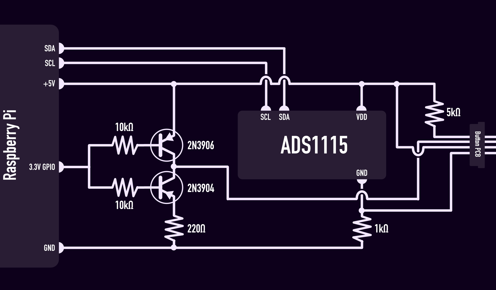

# NV7 Pi Controller
A custom controller designed to work with the existing Phantex NV7 RGB controller hardware. Instead of controlling the RGB directly, button presses are sent via MQTT messages.

## Install
Download the latest build to your Raspberry Pi and ensure the following environment variable is set:

```env
MQTT_PUBLISHER_HOST=<broker_host>:<broker:port>
```
For a full list of optional variables, see [the config](./config/config.go).

## Configure themes
The themes are configured in a `themes.yaml` file which should be placed in the same directory as the controller. The controller supports 2 channels (`A` and `B`) and any number of theme/colour options as you like. The controller will cycle through the themes and colours in the order they are defined in this file and each time an event is fired from the controller, the MQTT message will contain the current state of the controller.

Example

```yaml
A:
  channel-a-theme-1:
  channel-a-theme-2: 
    - pink
    - blue
    - aqua
B:
  channel-b-theme-1: 
    - purple
    - blue
  channel-b-theme-2: 
    - red
    - green
```

## MQTT Messages
The MQTT publisher is configured to send a single JSON payload for each event. Each paylaod will contain the button (if applicable) which triggered the event, the current theme, current colour, current speed and current channel. The messages will be sent to a topic which uses the event type such as: `NV7/CONTROLLER/BUTTON_PRESSED`. A full list of possible events can be found [here](./pkg/controller/controller.go#L16-L20).

Example message
```json
{
  "button": "MODE",
  "theme": "my-cool-theme",
  "colour": "red",
  "speed": 1
}
```

## Hardware requirements
This is not a plug and play solution, in order for the Raspberry Pi to be able to interface with the button PCB in the NV7, there is some additional circuitry that is required. The button PCB requires 5V to run and uses a resistor ladder to key the button inputs but the Raspberry Pi only has 3.3V GPIO pins and has no analong inputs. This means we need 2 solutions; a digitial switch which is able to switch the led line between ground and 5V and an [analog to digital converter](https://en.wikipedia.org/wiki/Analog-to-digital_converter) to read the button key. 

This is the schematic for the circuit I use to connect to the button PCB:

- 2x 10k ohm resisitors
- 1x 1k ohm resisitor
- 1x 5k ohm resisitor
- 1x 220 ohm resisitor
- 1x 2N3906 transistor
- 1x 2N3904 transistor
- 1x ADS1115 analog to digital converter



_note: I am by no means an electrical engineer, this circuit was put together through lots of trial and error. It works but there may be better/more efficient way to achieve the same thing. If by chance someone does have a better idea for this, I would love to hear your thoughts._

## Future development
I dont have any plans for future development but I have set the controller up to work with any number of publishers so it should be fairly easy to configure a new publisher, for example a REST publisher. It would be nice to write either a debugger or a configure option to make the set up of this easier for people building their own solutions but as this is a very particular and highly nieche use case, I dont imagine lots of people, if any using this code - that being said, if you are using this I would love to know how and why you're using it.
